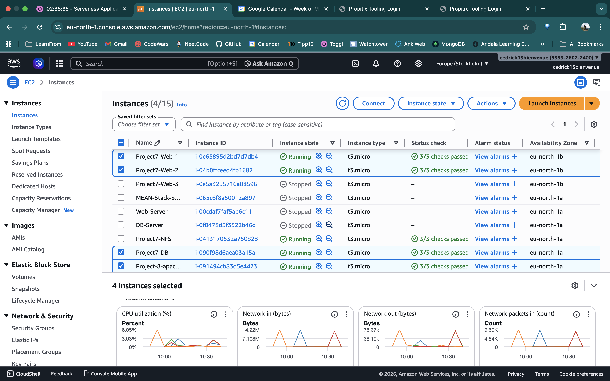
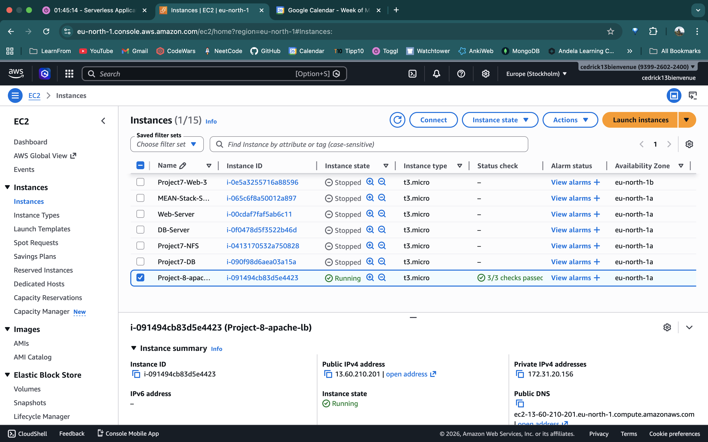
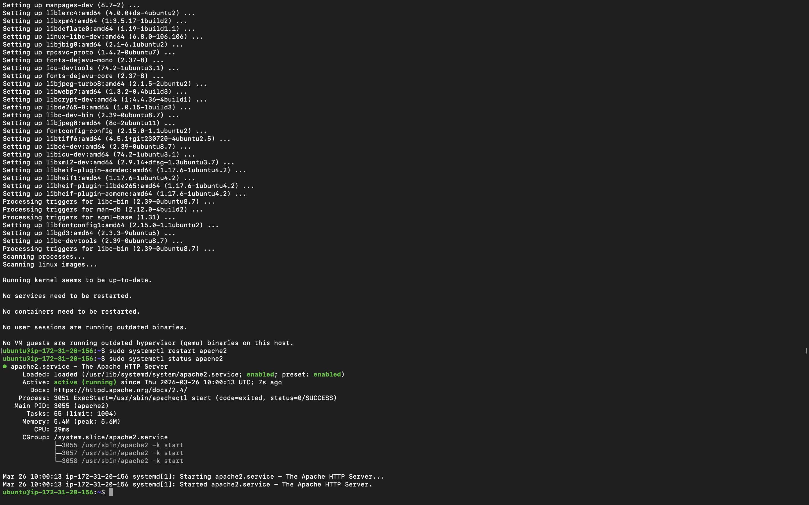
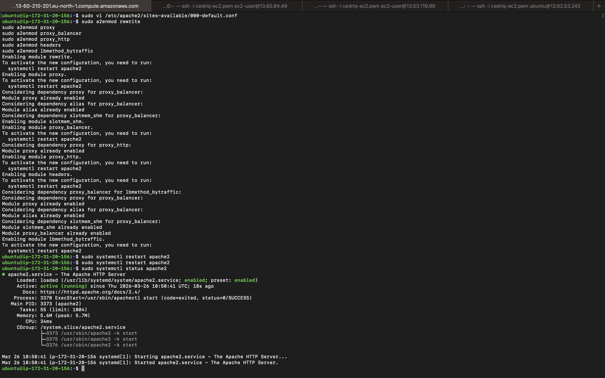
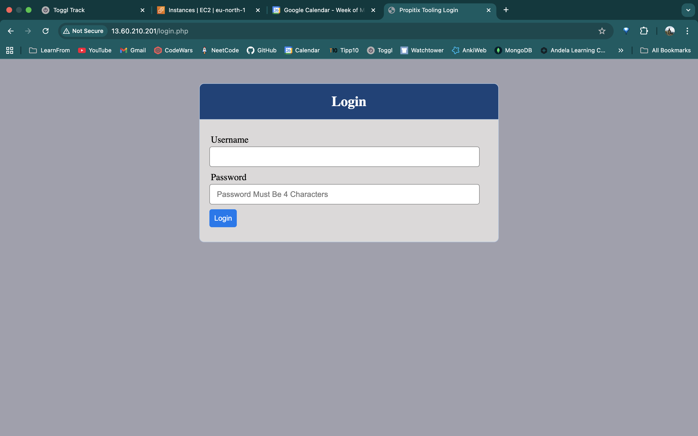
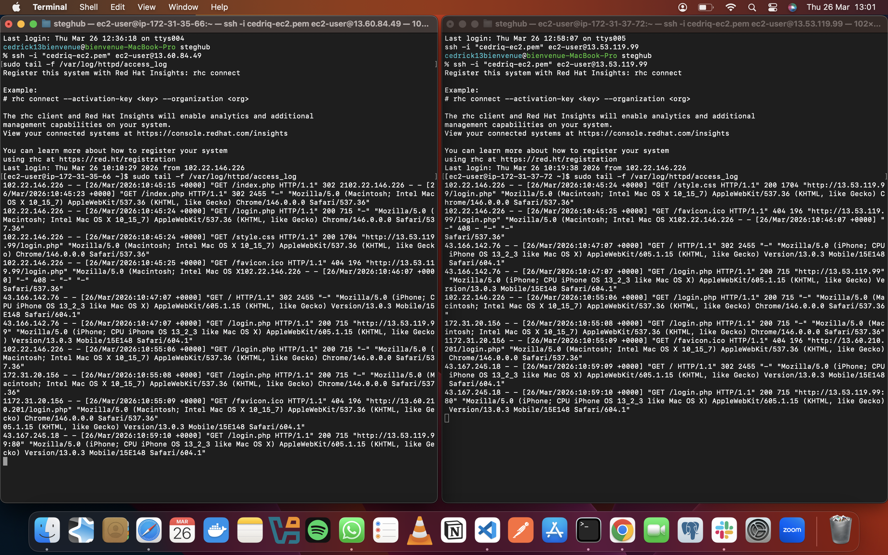
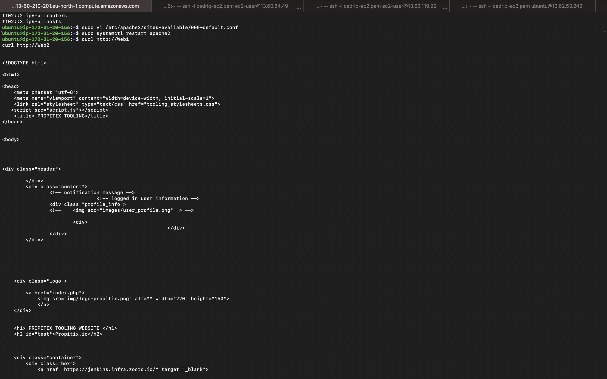

# Load Balancer Solution With Apache

## Project Overview

This project enhances the **Propitix Tooling Website** infrastructure from the previous project by introducing an **Apache Load Balancer** on a dedicated Ubuntu EC2 instance. Instead of users accessing each Web Server directly via different IPs, all traffic now flows through a single Load Balancer URL — hiding the complexity of multiple backend servers and distributing requests evenly between them.

**Technologies Used:**

| Component | Details |
|---|---|
| Infrastructure | AWS EC2 |
| Load Balancer OS | Ubuntu Server 24.04 LTS |
| Web Server OS | Red Hat Enterprise Linux 8 |
| Database OS | Ubuntu Server 20.04 LTS |
| Load Balancer Software | Apache2 (`mod_proxy_balancer`) |
| Web Server Software | Apache (`httpd`) + PHP 8.3 |
| Database | MySQL |
| Load Balancing Method | `bytraffic` |

**Architecture:**

```
                    Browser (Client)
                          |
                    TCP port 80
                          |
                   Load Balancer          ← Ubuntu 24.04 (Apache2 + mod_proxy_balancer)
                  <LB-PUBLIC-IP>
                  /             \
           TCP 80                TCP 80
              /                     \
       Web-Server-1            Web-Server-2   ← RHEL 8 (Apache httpd + PHP)
      <WS1-PRIVATE-IP>        <WS2-PRIVATE-IP>
              |                     |
              └──────────┬──────────┘
                    TCP 3306
                         |
                    DB Server              ← Ubuntu 20.04 (MySQL)
                  <DB-PRIVATE-IP>
                         |
              ┌──────────┴──────────┐
         TCP/UDP 2049            TCP/UDP 2049
              |                     |
       Web-Server-1            Web-Server-2
              └──────────┬──────────┘
                    NFS Server             ← RHEL 8 (/mnt/apps)
                  <NFS-PRIVATE-IP>
```

---

## Prerequisites

The following servers from the previous project (DevOps Tooling Website Solution) must be running and properly configured before starting this project:

| Server | Name | Public IP | Private IP |
|---|---|---|---|
| Web Server 1 | `Project7-Web-1` | `<WS1-PUBLIC-IP>` | `<WS1-PRIVATE-IP>` |
| Web Server 2 | `Project7-Web-2` | `<WS2-PUBLIC-IP>` | `<WS2-PRIVATE-IP>` |
| NFS Server | `Project7-NFS` | `<NFS-PUBLIC-IP>` | `<NFS-PRIVATE-IP>` |
| DB Server | `Project7-DB` | `<DB-PUBLIC-IP>` | `<DB-PRIVATE-IP>` |

**Prerequisite checklist:**
- Apache (`httpd`) is running on both Web Servers
- `/var/www` is mounted to the NFS server's `/mnt/apps` on both Web Servers
- Both Web Servers are reachable in the browser via their public IPs
- MySQL is running on the DB Server
- The `tooling` database and `webaccess` user exist with correct privileges

> **Troubleshooting note:** If the Tooling Website returns a `500 Internal Server Error` on the Web Servers, SELinux is likely blocking Apache from connecting to the database. Fix it on both Web Servers:
> ```bash
> sudo setsebool -P httpd_can_network_connect_db 1
> sudo setsebool -P httpd_can_network_connect 1
> ```

> 

---

## Phase 1: Launch the Load Balancer EC2 Instance

### 1.1 Create the EC2 Instance

**1.** Sign in to **AWS Management Console** → go to **EC2** → click **Instances** → click **Launch instances**.

**2.** Under **Name and tags**:

| Field | Value |
|---|---|
| **Name** | `Project-8-apache-lb` |

**3.** Under **Application and OS Images (Amazon Machine Image)**:

| Field | Value |
|---|---|
| **AMI** | Click **"Ubuntu"** from the quick-select tabs |
| **Version** | `Ubuntu Server 20.04 LTS (HVM), SSD Volume Type` |
| **Architecture** | `64-bit (x86)` |

**4.** Under **Instance type**:

| Field | Value |
|---|---|
| **Instance type** | `t2.micro` (Free tier eligible) |

**5.** Under **Key pair (login)**:

| Field | Value |
|---|---|
| **Key pair name** | Select your existing `.pem` key pair |

**6.** Under **Network settings** → click **Edit**:

| Field | Value |
|---|---|
| **VPC** | Same VPC as your Web Servers (default VPC) |
| **Subnet** | Leave as default |
| **Auto-assign public IP** | `Enable` |
| **Firewall** | Select **"Create security group"** |
| **Security group name** | `Project-8-LB-SG` |
| **Description** | `Security group for Apache Load Balancer` |

**Inbound Rules:**

| Type | Protocol | Port Range | Source Type | Source |
|---|---|---|---|---|
| `HTTP` | `TCP` | `80` | `Anywhere-IPv4` | `0.0.0.0/0` |
| `SSH` | `TCP` | `22` | `My IP` | your current IP (auto-filled) |

**7.** Under **Configure storage**:

| Field | Value |
|---|---|
| **Root volume size** | `8 GiB` (default) |
| **Volume type** | `gp2` or `gp3` |

**8.** Click **Launch instance**. Wait until:
- **Instance State** = `Running`
- **Status checks** = `2/2 checks passed`

> **Expected Output**: The EC2 instances list shows `Project-8-apache-lb` in `Running` state.
> 

---

## Phase 2: Install and Configure Apache as a Load Balancer

### 2.1 SSH into the Load Balancer

Open your terminal and connect:

```bash
ssh -i "your-key.pem" ubuntu@<LB-Public-IP>
```

> **Note**: Ubuntu EC2 instances use `ubuntu` as the default SSH user — not `ec2-user`.

---

### 2.2 Install Apache and Required Libraries

```bash
# Update package list and install Apache
sudo apt update
sudo apt install apache2 -y
sudo apt-get install libxml2-dev -y
```

| Package | Purpose |
|---|---|
| `apache2` | The Apache web server — acts as the load balancer |
| `libxml2-dev` | XML development library required by Apache proxy modules |

Restart Apache and verify it is running:

```bash
sudo systemctl restart apache2
sudo systemctl status apache2
```

> **Expected Output**: `apache2.service` shows `Active: active (running)`.
> 

---

### 2.3 Enable Required Apache Modules

Apache's load balancing functionality depends on several modules that must be explicitly enabled:

```bash
sudo a2enmod rewrite
sudo a2enmod proxy
sudo a2enmod proxy_balancer
sudo a2enmod proxy_http
sudo a2enmod headers
sudo a2enmod lbmethod_bytraffic
```

| Module | Purpose |
|---|---|
| `rewrite` | URL rewriting support |
| `proxy` | Core reverse proxy functionality |
| `proxy_balancer` | Load balancing between multiple backends |
| `proxy_http` | HTTP protocol proxying to backend servers |
| `headers` | Manipulation of HTTP request/response headers |
| `lbmethod_bytraffic` | Distributes load based on traffic volume (bytes transferred) |

Restart Apache to activate the modules:

```bash
sudo systemctl restart apache2
sudo systemctl status apache2
```

> **Expected Output**: Each module shows `Enabling module <name>.` followed by a prompt to restart Apache. After restart, `apache2.service` remains `active (running)`.
> 

---

### 2.4 Configure Load Balancing

Open the default Apache virtual host configuration file:

```bash
sudo vi /etc/apache2/sites-available/000-default.conf
```

Inside the `<VirtualHost *:80>` block, add the following configuration — replacing the IPs with your Web Servers' **private** IPs:

```apache
<Proxy "balancer://mycluster">
    BalancerMember http://<WebServer1-Private-IP>:80 loadfactor=5 timeout=1
    BalancerMember http://<WebServer2-Private-IP>:80 loadfactor=5 timeout=1
    ProxySet lbmethod=bytraffic
    # ProxySet lbmethod=byrequests
</Proxy>

ProxyPreserveHost On
ProxyPass / balancer://mycluster/
ProxyPassReverse / balancer://mycluster/
```

| Configuration Directive | Purpose |
|---|---|
| `BalancerMember http://IP:80` | Registers a backend Web Server in the cluster |
| `loadfactor=5` | Weight assigned to each server — equal values = 50/50 traffic split |
| `timeout=1` | If a backend does not respond within 1 second, move to the next |
| `lbmethod=bytraffic` | Distributes load proportionally by bytes transferred |
| `ProxyPreserveHost On` | Forwards the original `Host` header to the backend |
| `ProxyPass /` | Forwards all incoming requests to the balancer cluster |
| `ProxyPassReverse /` | Rewrites `Location` headers in backend redirect responses |

Save and exit (`:wq`), then restart Apache:

```bash
sudo systemctl restart apache2
```

---

## Phase 3: Verify Load Balancing

### 3.1 Test in the Browser

Open your browser and navigate to:

```
http://<Load-Balancer-Public-IP>/index.php
```

> **Expected Output**: The Propitix Tooling Website login page loads — with the URL bar showing the Load Balancer's IP, not any individual Web Server IP.
> 

---

### 3.2 Verify Both Web Servers Receive Traffic

Open **two separate terminal windows** and SSH into each Web Server. On both, tail the Apache access log:

```bash
# On Web Server 1
sudo tail -f /var/log/httpd/access_log

# On Web Server 2 (separate terminal)
sudo tail -f /var/log/httpd/access_log
```

Refresh the browser page at `http://<LB-Public-IP>/index.php` several times. Observe both terminals — new log entries with the **Load Balancer's private IP** (`<LB-PRIVATE-IP>`) should appear in **both** servers' logs, confirming that requests are being distributed between them.

> **Expected Output**: Both access logs show incoming requests from the LB's private IP. The number of requests per server is approximately equal since `loadfactor` is identical for both.
> 

---

## Phase 4: Configure Local DNS Name Resolution (Optional)

Instead of using raw IP addresses in the LB configuration, configure human-readable hostnames on the LB server using `/etc/hosts`. This is local to the LB server only — the names will not resolve anywhere else.

### 4.1 Add Hostnames to /etc/hosts

On the **LB server**, open the hosts file:

```bash
sudo vi /etc/hosts
```

Add the following two lines at the bottom (using your Web Servers' **private** IPs):

```
<WebServer1-Private-IP>  Web1
<WebServer2-Private-IP>  Web2
```

Example:
```
<WS1-PRIVATE-IP>  Web1
<WS2-PRIVATE-IP>  Web2
```

Save and exit (`:wq`).

---

### 4.2 Update the LB Config to Use Hostnames

```bash
sudo vi /etc/apache2/sites-available/000-default.conf
```

Replace the `BalancerMember` lines:

**Before:**
```apache
BalancerMember http://<WS1-PRIVATE-IP>:80 loadfactor=5 timeout=1
BalancerMember http://<WS2-PRIVATE-IP>:80 loadfactor=5 timeout=1
```

**After:**
```apache
BalancerMember http://Web1:80 loadfactor=5 timeout=1
BalancerMember http://Web2:80 loadfactor=5 timeout=1
```

Save and restart Apache:

```bash
sudo systemctl restart apache2
```

---

### 4.3 Test Local DNS Resolution

From the LB server, curl each Web Server using its hostname:

```bash
curl http://Web1
curl http://Web2
```

> **Expected Output**: Both commands return the full HTML source of the Propitix Tooling Website, confirming that `Web1` and `Web2` resolve correctly to the respective Web Servers via `/etc/hosts`.
> 

---

## Summary

This project successfully added a **Layer 7 Application Load Balancer** using Apache's `mod_proxy_balancer` in front of the existing two-node Tooling Website cluster. Key outcomes:

- All client traffic now enters through a **single public IP** — users access one URL regardless of how many backend servers exist
- The `bytraffic` load balancing method distributes requests proportionally based on bytes transferred, with equal `loadfactor=5` weights producing an approximately 50/50 traffic split
- Both Web Servers confirmed receiving requests from the LB's private IP via their Apache access logs
- Local DNS name resolution was configured on the LB server (`/etc/hosts`) to replace raw IP addresses with readable hostnames `Web1` and `Web2`
- The architecture is now horizontally scalable — additional Web Servers can be added by appending new `BalancerMember` lines to the configuration
- Study other `lbmethod` options: `byrequests`, `heartbeat`
